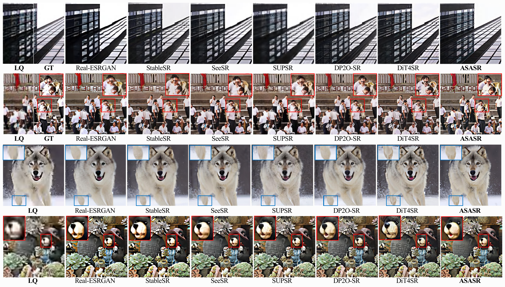
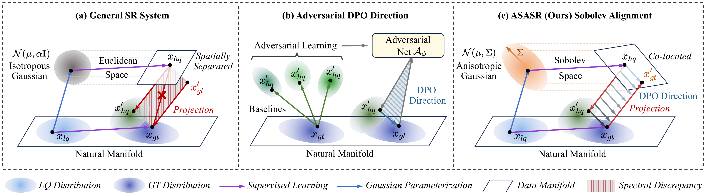

# [ASASR] Coloring the Noise: Adversarial Sobolev Alignment for Faithful Image Super-Resolution

[](https://arxiv.org/abs/2605.23264)
[](https://icml.cc/)
[](https://www.python.org/)

Official implementation of the ICML 2026 paper:

> **Coloring the Noise: Adversarial Sobolev Alignment for Faithful Image Super-Resolution**
> Hongbo Wang, Huaibo Huang, Pin Wang, Jinhua Hao, Chao Zhou, Ran He
> *International Conference on Machine Learning (ICML), 2026*
> [[arXiv:2605.23264]](https://arxiv.org/abs/2605.23264)

<p align="center">
  
</p>

---

## Highlights

<p align="center">
  
</p>

- 🎨 **Colored-Noise Flow** — replaces isotropic Gaussian noise with a spectrally shaped kernel aligned to the natural image manifold.
- 📐 **Sobolev-Induced Geometry** — reformulates the generative flow under a Riemannian metric that respects high-frequency structure (Sobolev frequency-weighted DPO, "S-DPO").
- ⚔️ **Adversarial Manifold Guidance (AMG)** — a Riesz-representation-based adversary network produces worst-case, spatially-aligned hard negatives for preference optimization ("AS-DPO").
- 🖼️ **Faithful Super-Resolution** — built on **FLUX.1-dev** with dual-LoRA inference (SR prior + DPO refinement); strong improvements in spectral consistency, structural fidelity, and artifact suppression.

---

## Table of Contents
1. [Installation](#1-installation)
2. [Pretrained Weights](#2-pretrained-weights)
3. [Data Preparation](#3-data-preparation)
4. [Training (full AS-DPO, 2 stages)](#4-training-full-as-dpo-2-stages)
5. [Inference](#5-inference)
6. [Evaluation](#6-evaluation)
7. [Quick Smoke Test](#7-quick-end-to-end-smoke-test)
8. [Scope & Notes](#8-scope--notes)

## Repository Layout

```
ASASR/
├── src/flux/                  # FLUX transformer / generate / condition / LoRA controller (OminiControl-style)
├── train_adversary.py         # Stage-1: SFT the AMG adversary LoRA
├── train.py                   # Stage-2: FLUX + Adversarial Sobolev-DPO (AS-DPO) trainer
├── inference.py               # FLUX + dual-LoRA inference (SR + DPO)
├── tools/
│   ├── make_paired_data.py    # Real-ESRGAN-style degradation → (HQ, LQ) pairs
│   ├── build_dataset.py       # Pack (HQ, LQ) folders into a HuggingFace Dataset
│   └── color_fix.py           # AdaIN / wavelet color correction (post-processing)
├── eval/eval_pyiqa.py         # PSNR/SSIM/LPIPS/DISTS/MANIQA/MUSIQ/CLIPIQA+ via pyiqa
├── scripts/
│   ├── train_adversary.sh     # Stage-1 adversary training (multi-GPU)
│   ├── train.sh               # Stage-2 AS-DPO training (multi-GPU)
│   ├── infer.sh               # dual-LoRA inference
│   └── eval.sh                # pyiqa evaluation
├── examples/                  # sample (lr, gt) pairs for smoke tests
└── checkpoints/               # weights go here (downloaded separately, see §2)
```

## 1. Installation

```bash
# Conda (recommended)
conda env create -f environment.yml
conda activate asasr

# Or pip into an existing env
pip install -r requirements.txt
```

Tested on **Python 3.10 + PyTorch 2.x (CUDA 11.8/12.x) + diffusers ≥ 0.30**. For other CUDA
versions, install the matching `torch` / `torchvision` wheels first, then `pip install -r requirements.txt`.

## 2. Pretrained Weights

The weights are **not stored in this Git repository** (each file exceeds GitHub's 100 MB limit).
They are hosted on the HuggingFace Hub at [**wafer-bob/ASASR**](https://huggingface.co/wafer-bob/ASASR).
Download them into `checkpoints/` in one command:

```bash
pip install -U "huggingface_hub[cli]"
huggingface-cli download wafer-bob/ASASR --local-dir ./checkpoints
```

This yields the layout below (see also `checkpoints/README.md`):

| Weight | Path | Size | Needed for |
|---|---|---|---|
| ASASR DPO LoRA | `checkpoints/dpo_lora/adapter_model.safetensors` | ~111 MB | **inference** |
| Base SR LoRA | `checkpoints/sr_lora/pytorch_lora_weights_v2.safetensors` | ~885 MB | **inference** |
| AMG adversary LoRA | `checkpoints/adv_lora/adapter_model.safetensors` | ~111 MB | training only (Stage-2) |
| FLUX.1-dev | local dir or HF Hub | ~24 GB | both |

- The base SR LoRA is trained on the [OminiControl](https://github.com/Yuanshi9815/OminiControl) FLUX dual-stream condition framework.
- For **FLUX.1-dev**, set `FLUX_MODEL_PATH=/path/to/FLUX.1-dev` to use a local checkout; otherwise it is pulled from the HuggingFace Hub (gated — `export HF_TOKEN=...` once). `HF_HUB_OFFLINE=1` forces fully-offline use.

## 3. Data Preparation

ASASR trains on paired (HQ, LQ) crops packed as a HuggingFace dataset with two columns:
`jpg_0` (HQ / GT) and `jpg_1` (LQ). We use **DIV2K + LSDIR** as HR sources and the higher-order
**Real-ESRGAN** degradation pipeline (hyper-parameters aligned with SeeSR / DreamClear), at a
scale factor of **×4** (HQ 512×512 / LQ 128×128).

### 3.1 Generate paired (HQ, LQ) data

```bash
python tools/make_paired_data.py \
    --gt_path /path/to/HR_images \
    --save_dir ./data/paired_train \
    --batch_size 192 --epoch 1
```

Output layout (`./data/paired_train/{gt,lr}/*.png`, HR 512×512 / LR 128×128).
The degradation knobs default to the full SeeSR-aligned strength; use `--deg_*` to weaken them.

### 3.2 Pack into a HuggingFace dataset

```bash
python tools/build_dataset.py --paired_dir ./data/paired_train --output_dir ./data/dataset
```

This produces a `datasets.Dataset` saved with `save_to_disk`, ready to pass as
`--dataset_name ./data/dataset` to the trainers.

## 4. Training (full AS-DPO, 2 stages)

The full paper method is **Adversarial Sobolev-DPO (AS-DPO)**: a Sobolev frequency-weighted DPO
objective whose hard negatives are synthesized on-the-fly by an **adversary network (AMG)**.
Reproduction is two stages.

### Stage 1 — train the AMG adversary

The adversary is SFT-trained to **mimic the reconstruction artifacts of baseline SR methods**
(e.g. Real-ESRGAN / SeeSR / SUPSR), so that during DPO it produces realistic, spatially-aligned
hard negatives. Build a dataset whose `jpg_0` = **baseline-SR output** (artifact proxy) and
`jpg_1` = the matching LQ (use `tools/build_dataset.py`, putting the baseline outputs in `gt/`):

```bash
ADV_DATASET=./data/adv_dataset bash scripts/train_adversary.sh
# → outputs/adv_*/final_adv_lora/adapter_model.safetensors
```

Copy the result to `checkpoints/adv_lora/adapter_model.safetensors` (or pass it via `ADV_LORA`).

| Var | Default | Meaning |
|---|---|---|
| `ADV_DATASET` | `./data/adv_dataset` | dataset with `jpg_0`=baseline output, `jpg_1`=LQ |
| `LR` | `5e-5` | AdamW learning rate (paper: adversary uses 5e-5) |
| `RANK` | `16` | adversary LoRA rank/α (paper main setting (16,16)) |
| `STEPS` | `1000` | optimizer steps |

### Stage 2 — Adversarial Sobolev-DPO

```bash
bash scripts/train.sh                 # full AS-DPO (uses checkpoints/adv_lora)
```

| Var | Default | Meaning |
|---|---|---|
| `FLUX_MODEL_PATH` | `black-forest-labs/FLUX.1-dev` | FLUX checkpoint dir / HF id |
| `DATASET` | `./data/dataset` | packed (HQ, LQ) dataset |
| `SR_LORA` | `./checkpoints/sr_lora/...` | base SR LoRA (frozen reference) |
| `ADV_LORA` | `./checkpoints/adv_lora/adapter_model.safetensors` | AMG adversary LoRA from Stage-1 |
| `ADV_STRENGTH` | `0.1` | λ, adversarial perturbation strength |
| `BETA` | `4000` | raw DPO β (effective β = 0.5·BETA = 2000, the paper value) |
| `SOBOLEV_S` | `1.5` | Sobolev exponent *s* |
| `NUM_GPUS` / `BATCH` / `GRAD_ACCUM` | `8` / `8` / `8` | global batch = 512 |
| `LR` | `1e-5` | AdamW learning rate |
| `STEPS` | `1000` | optimizer steps |
| `RESOLUTION` | `512` | HQ size (×4 SR, LQ = 128) |

Implementation details: BF16 mixed precision + gradient checkpointing, 200-step linear warmup,
empty text prompts, a frozen-SR-LoRA + zero-init-DPO-LoRA **dual-LoRA reference** strategy, and
a 28-step sampler at inference. The Sobolev spectral operator is realized with a 2-D FFT (`rfft2`)
on the latent velocity residual.

Outputs: `outputs/train_*/checkpoint-*/lora_dpo/adapter_model.safetensors`, each plug-compatible
with inference as `DPO_LORA`. Training was run on 8 GPUs.

## 5. Inference

```bash
bash scripts/infer.sh
# → outputs/inference/*.png  (+ *_pair.png: input | output side-by-side)
```

Manual invocation:

```bash
python inference.py \
    --input_dir examples/lr \
    --output_dir outputs/inference \
    --sr_lora_path checkpoints/sr_lora/pytorch_lora_weights_v2.safetensors \
    --dpo_lora_path checkpoints/dpo_lora/adapter_model.safetensors \
    --sr_scale 1.0 --dpo_scale 1.0 \
    --resolution 512 --num_gpus 1 --save_pair
```

- `FLUX_MODEL_PATH=/path/to/FLUX.1-dev` — use a local FLUX checkpoint.
- `HF_HUB_OFFLINE=1` — fully offline.
- Multi-GPU via `--num_gpus N` (one process per GPU, images sharded round-robin).

## 6. Evaluation

`eval/eval_pyiqa.py` reports the paper's full metric set via
[`pyiqa`](https://github.com/chaofengc/IQA-PyTorch):
**PSNR / SSIM** (Y channel of YCbCr), **LPIPS / DISTS** (full-reference perceptual), and
**MANIQA / MUSIQ / CLIPIQA+** (no-reference). SR/HR pairs are matched by filename stem; metric
weights download on first run and cache under `~/.cache/torch/hub/pyiqa/`.

```bash
bash scripts/eval.sh
# or, compare any number of methods:
python eval/eval_pyiqa.py --gt_dir examples/gt \
    --sr_dirs asasr:outputs/inference seesr:/path/to/seesr dreamclear:/path/to/dc
```

## 7. Quick End-to-End Smoke Test

After installation and placing `sr_lora` + `dpo_lora` under `checkpoints/`:

```bash
# (1) imports
python -c "from src.flux import transformer, condition, generate; \
           from tools.color_fix import adain_color_fix; print('ok')"

# (2) inference on the bundled examples (~1 min on one A100)
bash scripts/infer.sh

# (3) evaluate the run
bash scripts/eval.sh
```

## 8. Scope & Notes

- **Resolution.** This release operates at **×4 SR with HQ 512 / LQ 128** (the configuration the
  released weights were trained for). All scripts default to 512.
- **Reproducibility.** The released `dpo_lora` is produced by the Stage-2 AS-DPO pipeline above.
  Exact numbers depend on the full DIV2K+LSDIR training set and the 8-GPU global batch of 512;
  the bundled examples are for smoke-testing, not for matching paper tables.
- **In this repo:** SR training (S-DPO / AS-DPO), the AMG adversary trainer, dual-LoRA inference,
  data synthesis, and the 7-metric IQA evaluation.
- **Not in this repo:** the downstream-task evaluations (COCO detection/segmentation, ADE20K,
  OCR), the user study, and the spectral (LSD) analysis reported in the paper — these reuse
  standard external toolkits and are out of scope for this code release.

## Citation

```bibtex
@inproceedings{wang2026asasr,
  title     = {Coloring the Noise: Adversarial Sobolev Alignment for Faithful Image Super-Resolution},
  author    = {Wang, Hongbo and Huang, Huaibo and Wang, Pin and Hao, Jinhua and Zhou, Chao and He, Ran},
  booktitle = {International Conference on Machine Learning (ICML)},
  year      = {2026}
}
```

## Acknowledgements

ASASR is built on the [FLUX.1-dev](https://huggingface.co/black-forest-labs/FLUX.1-dev) backbone,
uses [OminiControl](https://github.com/Yuanshi9815/OminiControl) for conditional LoRA control,
and follows the [BasicSR](https://github.com/XPixelGroup/BasicSR) / [SeeSR](https://github.com/cswry/SeeSR)
pipeline for degradation synthesis. We thank the authors of these projects.

## License

This project is released under [CC-BY-NC-4.0](LICENSE) for **non-commercial research use only**.

Copyright (c) 2026 The Authors and Kuaishou Technology.